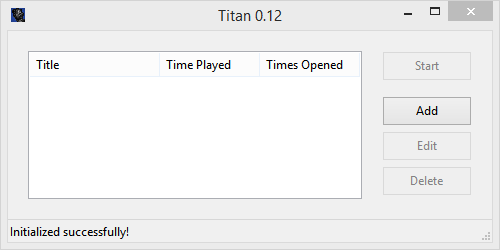
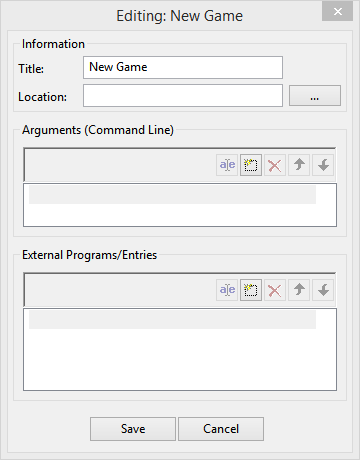
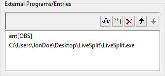

# Titan

Titan is a game/program launcher, tracker, and manager written in Python.

Latest Version: [v0.10](https://github.com/kyoto-shift/titan-py/releases/tag/v0.10)

## Features
* Minimally manage your game library.
* Easily "chain" programs together *(Example: opening OBS, LiveSplit, and your favorite Speedgame with one click)*.
* Keep track of how much you've used **any** program *(Example: track how long you've worked on a project in Ableton, how long you've played Titanfall 2, etc.)*.

## What Titan is not
* A fully-featured game library manager, such as: [Playnite](https://playnite.link/), [LaunchBox](https://www.launchbox-app.com/download), etc.
* A program to analyze program usage in-depth (yet)

## Installation

Titan can be installed either by downloading a [binary from the releases page](https://github.com/kyoto-shift/titan-py/releases), or by compiling it yourself.

### Automatic

* Download the latest release **(titan-vXXX-win.zip)** from [the releases page](https://github.com/kyoto-shift/titan-py/releases).
* Open the .zip file and extract the **titan** folder.
* Run **titan.exe**. *Note: You may need to run Titan as Administrator depending on where you extracted it/what entries you make.*

### Manual compilation

**Requirements: (requirements.txt)**  
* **Python 3.7.3** (other versions untested)
* **wxPython** - `pip install wxPython==4.0.6`
* **wxasync** - `pip install wxasync==0.4`
* **toml** - `pip install toml==0.10.0`


Compilation with PyInstaller: **(Recommended)**
```bash
git clone https://github.com/kyoto-shift/titan-py.git
cd titan/
pip install pyinstaller && pip install -r requirements.txt
pyinstaller -y -w -i "./titan_logo.ico" --add-data "./titan_logo.ico";"." --clean -n titan "./entrypoints/titan_gui.py"
```

Compilation with Setuptools:
```bash
git clone https://github.com/kyoto-shift/titan-py.git
cd titan/
python setup.py
```

## Usage

When you open up Titan for the first time, you'll see a screen like this:  


To add a new entry for a game/program, click "Add". You'll then see a screen like this:  


This screen allows you to customize how the entry is executed by Titan.  
* **Title** - The name Titan will use to reference the entry
* **Location** - The exact location of the executable
* **Arguments (Command Line)** - Command line arguments to be run with the main game/program. For example, `+exec autoexec.cfg` or `-windowed` in CS:GO
* **External Programs/Entries** - Locations of executables or entries to run **before** the main game/program

### Chaining entries

To chain entries, add a line to the **External Program/Entries** box using the following syntax:  
`ent[Exact Name Of Entry]`

  

### Manual editing

If you'd rather edit entries manually, you can edit the `titan_games.toml` file in Titan's installation directory. Since Titan uses Toml as its configuration language, it's very human readable and easy to work with. For more information about Toml, [click here](https://github.com/toml-lang/toml).

#### Configuration fields (each field is required)
* `["Entry Title"]` - The title of the current entry
* `time_played` (float) - How long a game/program has been run for (in seconds)
* `times_opened` (int) - How many times the game/program has been opened
* `location` (string) - The location of the game/program's executable
* `arguments` (list of strings) - Command-line arguments to be run with the main program
* `preloads` (list of strings) - Executables and entries to be run before the main game/program

**Notice**: The Titan configuration file contains a table called `titan_info`, this should not be modified.


## Contributing
Pull requests are welcome. For major changes, please open an issue first to discuss what you would like to change.

## License
[GNU GPLv2](https://choosealicense.com/licenses/gpl-2.0/)